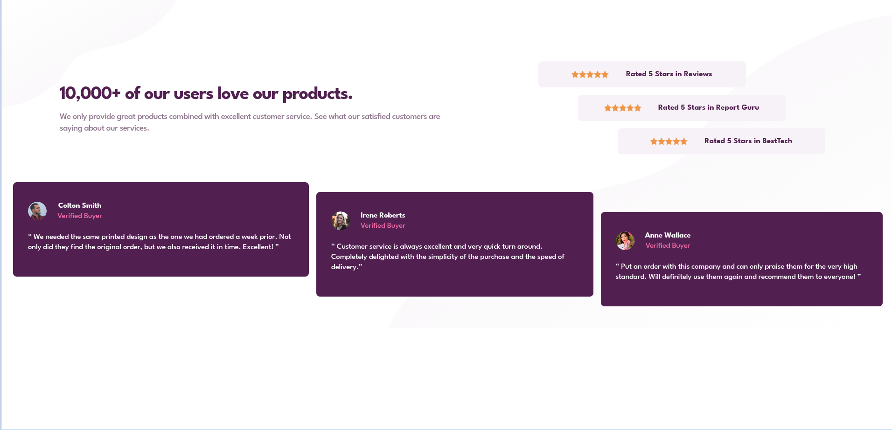

# Frontend Mentor - Social Proof Section Solution

This is a solution to the [Social Proof Section challenge on Frontend Mentor](https://www.frontendmentor.io/challenges/social-proof-section-6e0qTv_bA).

## Screenshot

## Links

- GitHub Repository: [https://github.com/TedJenkler/Social-proof-section-SCSS-Vite-ResponsiveAnimation](https://github.com/TedJenkler/Social-proof-section-SCSS-Vite-ResponsiveAnimation)
- Live Site: [https://tedjenkler.github.io/Social-proof-section-SCSS-Vite-ResponsiveAnimation/](https://tedjenkler.github.io/Social-proof-section-SCSS-Vite-ResponsiveAnimation/)

## My process

### Built with

- [Vite](https://vitejs.dev/) - Frontend build tool for fast development
- [SCSS](https://sass-lang.com/) - For advanced styling and animations

### Features

The app includes:

- **Responsiveness:** Fully responsive design ensuring optimal layout and user experience across various devices.
- **Animation:** Smooth animations implemented using CSS and JavaScript to enhance user interaction and visual appeal.

These features ensure a dynamic and engaging user experience while maintaining visual consistency across different screen sizes.

### Learnings

During this project, I concentrated on enhancing my proficiency in the following areas:

- **SCSS:** I improved my knowledge in SCSS, focusing on efficient use of variables, nesting, and mixins to create more organized and maintainable stylesheets.
- **CSS and JavaScript Dynamics:** I refined my eye for detail in CSS and JavaScript, specifically working on dynamically scaling elements and handling page changes to ensure smooth user interactions and visual appeal.

These improvements in SCSS and dynamic scaling will be applied to my future projects, including revisiting and enhancing larger projects with these refined skills.

### Continued Development

In future development, I plan to focus on:

- Improving the responsiveness between 375px and 1200px.
- Enhancing the SCSS styling and animations based on project needs.

For now, the implementation works as expected, and the primary goal was to practice SCSS.

### Resources

Helpful resources I used during this project:

- [SCSS Documentation](https://sass-lang.com/documentation) - Comprehensive guide to SCSS and its features.

### Author

- Frontend Mentor - [@TedJenkler](https://www.frontendmentor.io/profile/TedJenkler)
- LinkedIn - [Teodor Jenkler](https://www.linkedin.com/in/tedjenklerwebdeveloper/)
